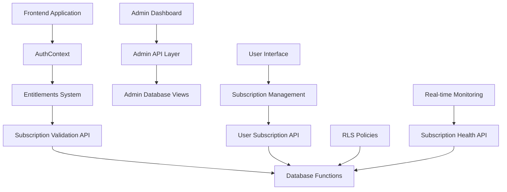

# Subscription System Integration Roadmap
## Technical Implementation Guide for Frontend Integration

## Overview

This document provides a detailed technical roadmap for integrating the completed subscription system backend with the BookTalks Buddy frontend application. The integration focuses on security, user experience, and operational visibility.

## Integration Architecture

### Core Integration Points



### Data Flow Architecture

```typescript
// Current Flow (INSECURE)
User Request → AuthContext → Entitlements Cache → Permission Check → Access Granted

// Target Flow (SECURE)
User Request → AuthContext → Subscription Validation → Entitlements Calculation → 
Real-time Permission Check → Access Granted/Denied
```

## Phase 1: Core Security Integration (Week 1)

### 1.1 Frontend Subscription Validation API

**File**: `src/lib/api/subscriptions/validation.ts` (NEW FILE)

```typescript
import { supabase } from '@/lib/supabase';

export interface SubscriptionStatus {
  hasActiveSubscription: boolean;
  currentTier: 'MEMBER' | 'PRIVILEGED' | 'PRIVILEGED_PLUS';
  subscriptionExpiry: string | null;
  isValid: boolean;
}

export interface SubscriptionDetails {
  id: string;
  userId: string;
  tier: string;
  subscriptionType: string;
  startDate: string;
  endDate: string;
  isActive: boolean;
  storeId: string;
}

// Core validation function - integrates with backend
export async function validateUserSubscription(userId: string): Promise<SubscriptionStatus> {
  try {
    // Call backend validation function
    const { data: hasActive, error: activeError } = await supabase
      .rpc('has_active_subscription', { p_user_id: userId });
    
    if (activeError) throw activeError;

    // Get current subscription tier
    const { data: currentTier, error: tierError } = await supabase
      .rpc('get_user_subscription_tier', { p_user_id: userId });
    
    if (tierError) throw tierError;

    // Get subscription details for expiry date
    const { data: subscription, error: subError } = await supabase
      .from('user_subscriptions')
      .select('end_date')
      .eq('user_id', userId)
      .eq('is_active', true)
      .order('end_date', { ascending: false })
      .limit(1)
      .single();

    return {
      hasActiveSubscription: hasActive,
      currentTier: currentTier as 'MEMBER' | 'PRIVILEGED' | 'PRIVILEGED_PLUS',
      subscriptionExpiry: subscription?.end_date || null,
      isValid: hasActive && currentTier !== 'MEMBER'
    };
  } catch (error) {
    console.error('Subscription validation error:', error);
    // Fail secure - deny access on error
    return {
      hasActiveSubscription: false,
      currentTier: 'MEMBER',
      subscriptionExpiry: null,
      isValid: false
    };
  }
}

// Batch validation for admin use
export async function validateUserEntitlements(userId: string): Promise<any> {
  const { data, error } = await supabase
    .rpc('validate_user_entitlements', { p_user_id: userId });
  
  if (error) throw error;
  return data;
}

// Get detailed subscription information
export async function getUserSubscriptionDetails(userId: string): Promise<SubscriptionDetails | null> {
  const { data, error } = await supabase
    .from('user_subscriptions')
    .select(`
      id,
      user_id,
      tier,
      subscription_type,
      start_date,
      end_date,
      is_active,
      store_id
    `)
    .eq('user_id', userId)
    .eq('is_active', true)
    .order('end_date', { ascending: false })
    .limit(1)
    .single();

  if (error && error.code !== 'PGRST116') throw error;
  return data;
}
```

### 1.2 AuthContext Integration

**File**: `src/contexts/AuthContext.tsx` (MODIFY EXISTING)

**Integration Points**:
```typescript
// Add to AuthContextType interface
type AuthContextType = {
  // ... existing properties
  
  // NEW: Subscription-aware properties
  subscriptionStatus: SubscriptionStatus | null;
  subscriptionLoading: boolean;
  refreshSubscriptionStatus: () => Promise<void>;
  hasValidSubscription: () => boolean;
  getSubscriptionTier: () => string;
};

// Add to AuthProvider component
const AuthProvider: React.FC<{ children: React.ReactNode }> = ({ children }) => {
  // ... existing state
  
  // NEW: Subscription state
  const [subscriptionStatus, setSubscriptionStatus] = useState<SubscriptionStatus | null>(null);
  const [subscriptionLoading, setSubscriptionLoading] = useState(false);

  // NEW: Subscription validation function
  const refreshSubscriptionStatus = async () => {
    if (!user) {
      setSubscriptionStatus(null);
      return;
    }

    try {
      setSubscriptionLoading(true);
      const status = await validateUserSubscription(user.id);
      setSubscriptionStatus(status);
    } catch (error) {
      console.error('Failed to refresh subscription status:', error);
      // Fail secure
      setSubscriptionStatus({
        hasActiveSubscription: false,
        currentTier: 'MEMBER',
        subscriptionExpiry: null,
        isValid: false
      });
    } finally {
      setSubscriptionLoading(false);
    }
  };

  // NEW: Convenience functions
  const hasValidSubscription = () => {
    return subscriptionStatus?.isValid || false;
  };

  const getSubscriptionTier = () => {
    return subscriptionStatus?.currentTier || 'MEMBER';
  };

  // MODIFY: Existing useEffect to include subscription validation
  useEffect(() => {
    // ... existing auth logic
    
    // Add subscription validation when user changes
    if (user) {
      refreshSubscriptionStatus();
    }
  }, [user]);
};
```

### 1.3 Entitlements System Integration

**File**: `src/lib/entitlements/membership.ts` (MODIFY EXISTING)

**Key Changes**:
```typescript
import { validateUserSubscription } from '@/lib/api/subscriptions/validation';

// MODIFY: calculateUserEntitlements function
export async function calculateUserEntitlements(
  userId: string, 
  forceRefresh: boolean = false
): Promise<string[]> {
  try {
    // NEW: Validate subscription before calculating entitlements
    const subscriptionStatus = await validateUserSubscription(userId);
    
    // Use subscription-validated tier instead of database tier
    const effectiveTier = subscriptionStatus.currentTier;
    
    // Only grant premium entitlements if subscription is valid
    if (!subscriptionStatus.hasActiveSubscription && effectiveTier !== 'MEMBER') {
      console.warn(`User ${userId} has tier ${effectiveTier} but no active subscription`);
      // Force to MEMBER tier for entitlement calculation
      return getEntitlementsForTier('MEMBER');
    }

    return getEntitlementsForTier(effectiveTier);
  } catch (error) {
    console.error('Error calculating user entitlements:', error);
    // Fail secure - return minimal entitlements
    return getEntitlementsForTier('MEMBER');
  }
}

// NEW: Subscription-aware permission checking
export async function hasValidPermission(
  userId: string, 
  requiredPermission: string
): Promise<boolean> {
  const subscriptionStatus = await validateUserSubscription(userId);
  
  if (!subscriptionStatus.hasActiveSubscription) {
    // Only allow MEMBER-level permissions for users without active subscriptions
    const memberEntitlements = getEntitlementsForTier('MEMBER');
    return memberEntitlements.includes(requiredPermission);
  }

  const userEntitlements = await calculateUserEntitlements(userId);
  return userEntitlements.includes(requiredPermission);
}
```

### 1.4 Cache Integration

**File**: `src/lib/entitlements/cache.ts` (MODIFY EXISTING)

**Key Changes**:
```typescript
// MODIFY: Cache key to include subscription validation
function getCacheKey(userId: string): string {
  return `entitlements:${userId}:subscription-aware`;
}

// NEW: Subscription-aware cache invalidation
export function invalidateSubscriptionCache(userId: string): void {
  const cacheKey = getCacheKey(userId);
  entitlementsCache.delete(cacheKey);
  
  // Also clear any related caches
  const relatedKeys = Array.from(entitlementsCache.keys())
    .filter(key => key.includes(userId));
  
  relatedKeys.forEach(key => entitlementsCache.delete(key));
}

// MODIFY: getUserEntitlements to include subscription validation
export async function getUserEntitlements(
  userId: string, 
  forceRefresh: boolean = false
): Promise<string[]> {
  const cacheKey = getCacheKey(userId);
  
  if (!forceRefresh && entitlementsCache.has(cacheKey)) {
    const cached = entitlementsCache.get(cacheKey);
    if (cached && Date.now() - cached.timestamp < CACHE_DURATION) {
      return cached.entitlements;
    }
  }

  // NEW: Use subscription-aware entitlement calculation
  const entitlements = await calculateUserEntitlements(userId, forceRefresh);
  
  entitlementsCache.set(cacheKey, {
    entitlements,
    timestamp: Date.now()
  });

  return entitlements;
}
```

## Phase 2: Database Security Updates (Week 1)

### 2.1 RLS Policy Updates

**File**: `supabase/migrations/20250106_001_update_rls_policies.sql` (NEW FILE)

```sql
-- Update RLS policies to use subscription validation
-- This migration updates all RLS policies to properly validate subscriptions

-- Book Clubs Access Policy Update
DROP POLICY IF EXISTS "book_clubs_access_policy" ON book_clubs;
CREATE POLICY "book_clubs_access_policy" ON book_clubs
FOR SELECT USING (
  -- Public clubs are accessible to all authenticated users
  access_tier_required = 'free'
  OR
  -- Premium clubs require active subscription
  (
    access_tier_required = 'all_premium' 
    AND has_active_subscription(auth.uid())
  )
  OR
  -- Privileged+ clubs require specific tier and active subscription
  (
    access_tier_required = 'privileged_plus'
    AND get_user_subscription_tier(auth.uid()) = 'PRIVILEGED_PLUS'
    AND has_active_subscription(auth.uid())
  )
  OR
  -- Club owners and admins always have access
  EXISTS (
    SELECT 1 FROM club_members cm
    WHERE cm.club_id = book_clubs.id
    AND cm.user_id = auth.uid()
    AND cm.role IN ('owner', 'admin')
  )
);

-- Club Members Access Policy Update
DROP POLICY IF EXISTS "club_members_access_policy" ON club_members;
CREATE POLICY "club_members_access_policy" ON club_members
FOR SELECT USING (
  -- Users can see their own memberships
  user_id = auth.uid()
  OR
  -- Members can see other members if they have access to the club
  EXISTS (
    SELECT 1 FROM book_clubs bc
    WHERE bc.id = club_members.club_id
    AND (
      bc.access_tier_required = 'free'
      OR (
        bc.access_tier_required = 'all_premium'
        AND has_active_subscription(auth.uid())
      )
      OR (
        bc.access_tier_required = 'privileged_plus'
        AND get_user_subscription_tier(auth.uid()) = 'PRIVILEGED_PLUS'
        AND has_active_subscription(auth.uid())
      )
    )
  )
);

-- Add similar updates for other tables that use tier-based access
-- (Continue with other RLS policies...)
```

### 2.2 Permission Validation Triggers

**File**: `supabase/migrations/20250106_002_add_permission_triggers.sql` (NEW FILE)

```sql
-- Add triggers to validate permissions on data modification
-- This ensures subscription validation happens at the database level

-- Function to validate subscription before premium actions
CREATE OR REPLACE FUNCTION validate_subscription_for_action()
RETURNS TRIGGER AS $$
BEGIN
  -- Skip validation for system operations
  IF current_setting('app.bypass_subscription_check', true) = 'true' THEN
    RETURN NEW;
  END IF;

  -- Validate subscription for premium actions
  IF NOT has_active_subscription(auth.uid()) THEN
    -- Check if this action requires premium access
    -- (Implementation depends on specific table and action)
    RAISE EXCEPTION 'Active subscription required for this action';
  END IF;

  RETURN NEW;
END;
$$ LANGUAGE plpgsql SECURITY DEFINER;

-- Apply trigger to relevant tables
-- (Add triggers to tables that require subscription validation)
```

## Phase 3: Admin Dashboard Integration (Week 2)

### 3.1 Admin API Layer

**File**: `src/lib/api/admin/subscriptions.ts` (NEW FILE)

```typescript
import { supabase } from '@/lib/supabase';

export interface AdminSubscriptionOverview {
  totalUsers: number;
  activeSubscriptions: number;
  expiredActiveSubscriptions: number;
  usersWithInvalidEntitlements: number;
  revenueThisMonth: number;
  subscriptionsByTier: {
    member: number;
    privileged: number;
    privileged_plus: number;
  };
}

export interface ProblematicUser {
  userId: string;
  username: string;
  email: string;
  membershipTier: string;
  hasActiveSubscription: boolean;
  lastSubscriptionEnd: string | null;
  issueDescription: string;
}

// Get comprehensive subscription system overview
export async function getSubscriptionOverview(): Promise<AdminSubscriptionOverview> {
  const { data, error } = await supabase
    .from('admin_subscription_overview')
    .select('*')
    .single();

  if (error) throw error;

  return {
    totalUsers: data.total_users || 0,
    activeSubscriptions: data.active_subscriptions || 0,
    expiredActiveSubscriptions: data.expired_active_subscriptions || 0,
    usersWithInvalidEntitlements: data.users_with_invalid_entitlements || 0,
    revenueThisMonth: data.revenue_this_month || 0,
    subscriptionsByTier: {
      member: data.member_count || 0,
      privileged: data.privileged_count || 0,
      privileged_plus: data.privileged_plus_count || 0
    }
  };
}

// Get users with subscription/entitlement mismatches
export async function getProblematicUsers(): Promise<ProblematicUser[]> {
  const { data, error } = await supabase
    .from('admin_problematic_users')
    .select('*')
    .order('membership_tier', { ascending: false });

  if (error) throw error;

  return data.map(user => ({
    userId: user.user_id,
    username: user.username,
    email: user.email,
    membershipTier: user.membership_tier,
    hasActiveSubscription: user.has_active_subscription,
    lastSubscriptionEnd: user.last_subscription_end,
    issueDescription: user.issue_description
  }));
}

// Run emergency fix for all entitlement mismatches
export async function runEmergencyEntitlementsFix(): Promise<any> {
  const { data, error } = await supabase
    .rpc('emergency_fix_all_entitlements');

  if (error) throw error;
  return data;
}

// Get subscription health status
export async function getSubscriptionHealthStatus(): Promise<any> {
  const { data, error } = await supabase
    .rpc('check_subscription_health');

  if (error) throw error;
  return data;
}

// Process expired subscriptions manually
export async function processExpiredSubscriptions(): Promise<any> {
  const { data, error } = await supabase
    .rpc('process_expired_subscriptions');

  if (error) throw error;
  return data;
}
```

### 3.2 Admin Dashboard Components

**File**: `src/components/admin/SubscriptionOverviewCard.tsx` (NEW FILE)

```typescript
import React, { useState, useEffect } from 'react';
import { Card, CardHeader, CardTitle, CardContent } from '@/components/ui/card';
import { Badge } from '@/components/ui/badge';
import { Button } from '@/components/ui/button';
import { AlertTriangle, CheckCircle, Users, DollarSign } from 'lucide-react';
import { getSubscriptionOverview, AdminSubscriptionOverview } from '@/lib/api/admin/subscriptions';
import { toast } from 'sonner';

export const SubscriptionOverviewCard: React.FC = () => {
  const [overview, setOverview] = useState<AdminSubscriptionOverview | null>(null);
  const [loading, setLoading] = useState(true);

  useEffect(() => {
    const fetchOverview = async () => {
      try {
        const data = await getSubscriptionOverview();
        setOverview(data);
      } catch (error) {
        console.error('Failed to fetch subscription overview:', error);
        toast.error('Failed to load subscription overview');
      } finally {
        setLoading(false);
      }
    };

    fetchOverview();
  }, []);

  if (loading) {
    return (
      <Card>
        <CardContent className="p-6">
          <div className="animate-pulse space-y-4">
            <div className="h-4 bg-gray-300 rounded w-1/2"></div>
            <div className="h-8 bg-gray-300 rounded"></div>
          </div>
        </CardContent>
      </Card>
    );
  }

  if (!overview) return null;

  return (
    <Card>
      <CardHeader>
        <CardTitle className="flex items-center gap-2">
          <Users className="h-5 w-5" />
          Subscription System Overview
        </CardTitle>
      </CardHeader>
      <CardContent>
        <div className="grid grid-cols-2 md:grid-cols-4 gap-4">
          <div className="text-center">
            <div className="text-2xl font-bold text-bookconnect-brown">
              {overview.totalUsers}
            </div>
            <div className="text-sm text-muted-foreground">Total Users</div>
          </div>
          
          <div className="text-center">
            <div className="text-2xl font-bold text-green-600">
              {overview.activeSubscriptions}
            </div>
            <div className="text-sm text-muted-foreground">Active Subscriptions</div>
          </div>
          
          <div className="text-center">
            <div className="text-2xl font-bold text-red-600">
              {overview.expiredActiveSubscriptions}
            </div>
            <div className="text-sm text-muted-foreground">Expired Active</div>
          </div>
          
          <div className="text-center">
            <div className="text-2xl font-bold text-orange-600">
              {overview.usersWithInvalidEntitlements}
            </div>
            <div className="text-sm text-muted-foreground">Invalid Entitlements</div>
          </div>
        </div>

        {overview.usersWithInvalidEntitlements > 0 && (
          <div className="mt-4 p-3 bg-orange-50 border border-orange-200 rounded-lg">
            <div className="flex items-center gap-2 text-orange-800">
              <AlertTriangle className="h-4 w-4" />
              <span className="font-medium">
                {overview.usersWithInvalidEntitlements} users have entitlement mismatches
              </span>
            </div>
          </div>
        )}
      </CardContent>
    </Card>
  );
};
```

## Phase 4: User Experience Integration (Week 2-3)

### 4.1 User Subscription Status Components

**File**: `src/components/subscription/SubscriptionStatusCard.tsx` (NEW FILE)

```typescript
import React, { useState, useEffect } from 'react';
import { Card, CardHeader, CardTitle, CardContent } from '@/components/ui/card';
import { Badge } from '@/components/ui/badge';
import { Button } from '@/components/ui/button';
import { Calendar, Crown, AlertCircle } from 'lucide-react';
import { useAuth } from '@/contexts/AuthContext';
import { getUserSubscriptionDetails, SubscriptionDetails } from '@/lib/api/subscriptions/validation';
import { format, differenceInDays } from 'date-fns';
import { toast } from 'sonner';

export const SubscriptionStatusCard: React.FC = () => {
  const { user, subscriptionStatus } = useAuth();
  const [subscriptionDetails, setSubscriptionDetails] = useState<SubscriptionDetails | null>(null);
  const [loading, setLoading] = useState(true);

  useEffect(() => {
    const fetchDetails = async () => {
      if (!user) return;

      try {
        const details = await getUserSubscriptionDetails(user.id);
        setSubscriptionDetails(details);
      } catch (error) {
        console.error('Failed to fetch subscription details:', error);
      } finally {
        setLoading(false);
      }
    };

    fetchDetails();
  }, [user]);

  if (!user || loading) return null;

  const getTierBadgeVariant = (tier: string) => {
    switch (tier) {
      case 'PRIVILEGED_PLUS': return 'default';
      case 'PRIVILEGED': return 'secondary';
      default: return 'outline';
    }
  };

  const getTierDisplayName = (tier: string) => {
    switch (tier) {
      case 'PRIVILEGED_PLUS': return 'Privileged+';
      case 'PRIVILEGED': return 'Privileged';
      default: return 'Member';
    }
  };

  const daysUntilExpiry = subscriptionDetails
    ? differenceInDays(new Date(subscriptionDetails.endDate), new Date())
    : null;

  return (
    <Card>
      <CardHeader>
        <CardTitle className="flex items-center gap-2">
          <Crown className="h-5 w-5" />
          Subscription Status
        </CardTitle>
      </CardHeader>
      <CardContent>
        <div className="space-y-4">
          <div className="flex items-center justify-between">
            <span className="text-sm font-medium">Current Tier</span>
            <Badge variant={getTierBadgeVariant(subscriptionStatus?.currentTier || 'MEMBER')}>
              {getTierDisplayName(subscriptionStatus?.currentTier || 'MEMBER')}
            </Badge>
          </div>

          {subscriptionDetails && (
            <>
              <div className="flex items-center justify-between">
                <span className="text-sm font-medium">Subscription Type</span>
                <span className="text-sm capitalize">{subscriptionDetails.subscriptionType}</span>
              </div>

              <div className="flex items-center justify-between">
                <span className="text-sm font-medium">Expires</span>
                <div className="text-right">
                  <div className="text-sm">
                    {format(new Date(subscriptionDetails.endDate), 'PPP')}
                  </div>
                  {daysUntilExpiry !== null && (
                    <div className={`text-xs ${daysUntilExpiry <= 7 ? 'text-red-600' : 'text-muted-foreground'}`}>
                      {daysUntilExpiry > 0 ? `${daysUntilExpiry} days remaining` : 'Expired'}
                    </div>
                  )}
                </div>
              </div>

              {daysUntilExpiry !== null && daysUntilExpiry <= 7 && daysUntilExpiry > 0 && (
                <div className="p-3 bg-orange-50 border border-orange-200 rounded-lg">
                  <div className="flex items-center gap-2 text-orange-800">
                    <AlertCircle className="h-4 w-4" />
                    <span className="text-sm font-medium">
                      Your subscription expires soon. Contact your store to renew.
                    </span>
                  </div>
                </div>
              )}
            </>
          )}

          {!subscriptionStatus?.hasActiveSubscription && subscriptionStatus?.currentTier !== 'MEMBER' && (
            <div className="p-3 bg-red-50 border border-red-200 rounded-lg">
              <div className="flex items-center gap-2 text-red-800">
                <AlertCircle className="h-4 w-4" />
                <span className="text-sm font-medium">
                  Your subscription has expired. Some features may be limited.
                </span>
              </div>
            </div>
          )}
        </div>
      </CardContent>
    </Card>
  );
};
```

### 4.2 Profile Integration

**File**: `src/pages/ProfilePage.tsx` (MODIFY EXISTING)

**Integration Points**:
```typescript
import { SubscriptionStatusCard } from '@/components/subscription/SubscriptionStatusCard';

// Add to profile page layout
const ProfilePage: React.FC = () => {
  // ... existing code

  return (
    <div className="container mx-auto px-4 py-8">
      <div className="grid grid-cols-1 lg:grid-cols-3 gap-8">
        <div className="lg:col-span-2">
          {/* Existing profile content */}
        </div>

        <div className="space-y-6">
          {/* NEW: Add subscription status */}
          <SubscriptionStatusCard />

          {/* Existing sidebar content */}
        </div>
      </div>
    </div>
  );
};
```

### 4.3 Access Control Components

**File**: `src/components/subscription/SubscriptionGate.tsx` (NEW FILE)

```typescript
import React from 'react';
import { useAuth } from '@/contexts/AuthContext';
import { Card, CardContent } from '@/components/ui/card';
import { Button } from '@/components/ui/button';
import { Crown, Lock } from 'lucide-react';

interface SubscriptionGateProps {
  requiredTier: 'PRIVILEGED' | 'PRIVILEGED_PLUS';
  children: React.ReactNode;
  fallback?: React.ReactNode;
}

export const SubscriptionGate: React.FC<SubscriptionGateProps> = ({
  requiredTier,
  children,
  fallback
}) => {
  const { subscriptionStatus, user } = useAuth();

  const hasRequiredAccess = () => {
    if (!subscriptionStatus || !user) return false;

    // Must have active subscription
    if (!subscriptionStatus.hasActiveSubscription) return false;

    // Check tier requirements
    if (requiredTier === 'PRIVILEGED_PLUS') {
      return subscriptionStatus.currentTier === 'PRIVILEGED_PLUS';
    }

    if (requiredTier === 'PRIVILEGED') {
      return ['PRIVILEGED', 'PRIVILEGED_PLUS'].includes(subscriptionStatus.currentTier);
    }

    return false;
  };

  if (hasRequiredAccess()) {
    return <>{children}</>;
  }

  if (fallback) {
    return <>{fallback}</>;
  }

  // Default access denied UI
  return (
    <Card>
      <CardContent className="p-6 text-center">
        <div className="flex flex-col items-center space-y-4">
          <div className="p-3 bg-orange-100 rounded-full">
            <Lock className="h-6 w-6 text-orange-600" />
          </div>

          <div>
            <h3 className="font-semibold text-lg mb-2">
              {requiredTier === 'PRIVILEGED_PLUS' ? 'Privileged+' : 'Privileged'} Access Required
            </h3>
            <p className="text-muted-foreground mb-4">
              This feature requires an active {requiredTier === 'PRIVILEGED_PLUS' ? 'Privileged+' : 'Privileged'} subscription.
            </p>
          </div>

          <Button variant="outline" className="flex items-center gap-2">
            <Crown className="h-4 w-4" />
            Contact Your Store to Upgrade
          </Button>
        </div>
      </CardContent>
    </Card>
  );
};
```

## Phase 5: Monitoring & Operations Integration (Week 3)

### 5.1 Real-time Subscription Monitoring

**File**: `src/components/admin/SubscriptionHealthMonitor.tsx` (NEW FILE)

```typescript
import React, { useState, useEffect } from 'react';
import { Card, CardHeader, CardTitle, CardContent } from '@/components/ui/card';
import { Badge } from '@/components/ui/badge';
import { Button } from '@/components/ui/button';
import { AlertTriangle, CheckCircle, RefreshCw, Zap } from 'lucide-react';
import {
  getSubscriptionHealthStatus,
  processExpiredSubscriptions,
  runEmergencyEntitlementsFix
} from '@/lib/api/admin/subscriptions';
import { toast } from 'sonner';

interface HealthStatus {
  checkId: string;
  expiredWithPremium: number;
  totalExpired: number;
  lastCheck: string;
  status: 'healthy' | 'warning' | 'critical';
}

export const SubscriptionHealthMonitor: React.FC = () => {
  const [healthStatus, setHealthStatus] = useState<HealthStatus | null>(null);
  const [loading, setLoading] = useState(true);
  const [processing, setProcessing] = useState(false);

  const fetchHealthStatus = async () => {
    try {
      setLoading(true);
      const status = await getSubscriptionHealthStatus();
      setHealthStatus(status);
    } catch (error) {
      console.error('Failed to fetch health status:', error);
      toast.error('Failed to load subscription health status');
    } finally {
      setLoading(false);
    }
  };

  useEffect(() => {
    fetchHealthStatus();

    // Set up periodic health checks
    const interval = setInterval(fetchHealthStatus, 5 * 60 * 1000); // Every 5 minutes
    return () => clearInterval(interval);
  }, []);

  const handleProcessExpired = async () => {
    try {
      setProcessing(true);
      const result = await processExpiredSubscriptions();
      toast.success(`Processed ${result.processed_count} expired subscriptions`);
      await fetchHealthStatus(); // Refresh status
    } catch (error) {
      console.error('Failed to process expired subscriptions:', error);
      toast.error('Failed to process expired subscriptions');
    } finally {
      setProcessing(false);
    }
  };

  const handleEmergencyFix = async () => {
    try {
      setProcessing(true);
      const result = await runEmergencyEntitlementsFix();
      toast.success(`Fixed ${result.fixed_count} entitlement mismatches`);
      await fetchHealthStatus(); // Refresh status
    } catch (error) {
      console.error('Failed to run emergency fix:', error);
      toast.error('Failed to run emergency fix');
    } finally {
      setProcessing(false);
    }
  };

  const getStatusColor = (status: string) => {
    switch (status) {
      case 'healthy': return 'text-green-600';
      case 'warning': return 'text-orange-600';
      case 'critical': return 'text-red-600';
      default: return 'text-gray-600';
    }
  };

  const getStatusIcon = (status: string) => {
    switch (status) {
      case 'healthy': return <CheckCircle className="h-5 w-5 text-green-600" />;
      case 'warning':
      case 'critical': return <AlertTriangle className="h-5 w-5 text-red-600" />;
      default: return <RefreshCw className="h-5 w-5 text-gray-600" />;
    }
  };

  if (loading) {
    return (
      <Card>
        <CardContent className="p-6">
          <div className="animate-pulse space-y-4">
            <div className="h-4 bg-gray-300 rounded w-1/2"></div>
            <div className="h-8 bg-gray-300 rounded"></div>
          </div>
        </CardContent>
      </Card>
    );
  }

  return (
    <Card>
      <CardHeader>
        <CardTitle className="flex items-center justify-between">
          <div className="flex items-center gap-2">
            {healthStatus && getStatusIcon(healthStatus.status)}
            Subscription System Health
          </div>
          <Button
            variant="outline"
            size="sm"
            onClick={fetchHealthStatus}
            disabled={loading}
          >
            <RefreshCw className={`h-4 w-4 ${loading ? 'animate-spin' : ''}`} />
          </Button>
        </CardTitle>
      </CardHeader>
      <CardContent>
        {healthStatus && (
          <div className="space-y-4">
            <div className="grid grid-cols-2 gap-4">
              <div className="text-center">
                <div className={`text-2xl font-bold ${getStatusColor(healthStatus.status)}`}>
                  {healthStatus.expiredWithPremium}
                </div>
                <div className="text-sm text-muted-foreground">
                  Users with Invalid Entitlements
                </div>
              </div>

              <div className="text-center">
                <div className="text-2xl font-bold text-gray-600">
                  {healthStatus.totalExpired}
                </div>
                <div className="text-sm text-muted-foreground">
                  Total Expired Subscriptions
                </div>
              </div>
            </div>

            {healthStatus.expiredWithPremium > 0 && (
              <div className="p-3 bg-red-50 border border-red-200 rounded-lg">
                <div className="flex items-center justify-between">
                  <div className="flex items-center gap-2 text-red-800">
                    <AlertTriangle className="h-4 w-4" />
                    <span className="font-medium">
                      Critical: {healthStatus.expiredWithPremium} users have premium access without valid subscriptions
                    </span>
                  </div>
                  <Button
                    size="sm"
                    variant="destructive"
                    onClick={handleEmergencyFix}
                    disabled={processing}
                    className="flex items-center gap-1"
                  >
                    <Zap className="h-3 w-3" />
                    Emergency Fix
                  </Button>
                </div>
              </div>
            )}

            <div className="flex gap-2">
              <Button
                variant="outline"
                onClick={handleProcessExpired}
                disabled={processing}
                className="flex-1"
              >
                Process Expired Subscriptions
              </Button>
            </div>

            <div className="text-xs text-muted-foreground">
              Last checked: {new Date(healthStatus.lastCheck).toLocaleString()}
            </div>
          </div>
        )}
      </CardContent>
    </Card>
  );
};
```

### 5.2 Admin Dashboard Integration

**File**: `src/pages/admin/AdminDashboardPage.tsx` (MODIFY EXISTING)

**Integration Points**:
```typescript
import { SubscriptionOverviewCard } from '@/components/admin/SubscriptionOverviewCard';
import { SubscriptionHealthMonitor } from '@/components/admin/SubscriptionHealthMonitor';
import { ProblematicUsersTable } from '@/components/admin/ProblematicUsersTable';

// Add to dashboard layout
const AdminDashboardPage: React.FC = () => {
  // ... existing code

  return (
    <div className="space-y-8">
      {/* Existing dashboard content */}

      {/* NEW: Subscription System Section */}
      <div className="mb-8">
        <div className="mb-4">
          <h2 className="text-xl font-semibold text-bookconnect-brown mb-1">
            Subscription System
          </h2>
          <p className="text-sm text-muted-foreground">
            Monitor and manage user subscriptions and entitlements
          </p>
        </div>

        <div className="grid grid-cols-1 lg:grid-cols-2 gap-6 mb-6">
          <SubscriptionOverviewCard />
          <SubscriptionHealthMonitor />
        </div>

        <ProblematicUsersTable />
      </div>

      {/* Existing analytics section */}
    </div>
  );
};
```

## Phase 6: Testing & Validation (Week 3-4)

### 6.1 Integration Testing Strategy

**File**: `src/tests/integration/subscription-integration.test.ts` (NEW FILE)

```typescript
import { describe, it, expect, beforeEach, afterEach } from 'vitest';
import { supabase } from '@/lib/supabase';
import { validateUserSubscription } from '@/lib/api/subscriptions/validation';
import { calculateUserEntitlements } from '@/lib/entitlements/membership';

describe('Subscription System Integration', () => {
  let testUserId: string;
  let testSubscriptionId: string;

  beforeEach(async () => {
    // Create test user and subscription
    // Setup test data
  });

  afterEach(async () => {
    // Cleanup test data
  });

  describe('Subscription Validation', () => {
    it('should validate active subscription correctly', async () => {
      const status = await validateUserSubscription(testUserId);
      expect(status.hasActiveSubscription).toBe(true);
      expect(status.currentTier).toBe('PRIVILEGED');
    });

    it('should deny access for expired subscription', async () => {
      // Expire the test subscription
      await supabase
        .from('user_subscriptions')
        .update({ end_date: new Date(Date.now() - 86400000).toISOString() })
        .eq('id', testSubscriptionId);

      const status = await validateUserSubscription(testUserId);
      expect(status.hasActiveSubscription).toBe(false);
      expect(status.isValid).toBe(false);
    });
  });

  describe('Entitlements Integration', () => {
    it('should calculate entitlements based on subscription status', async () => {
      const entitlements = await calculateUserEntitlements(testUserId);
      expect(entitlements).toContain('CAN_CREATE_BOOK_CLUBS');
      expect(entitlements).toContain('CAN_JOIN_PREMIUM_CLUBS');
    });

    it('should revoke premium entitlements for expired subscriptions', async () => {
      // Expire subscription
      await supabase
        .from('user_subscriptions')
        .update({ end_date: new Date(Date.now() - 86400000).toISOString() })
        .eq('id', testSubscriptionId);

      const entitlements = await calculateUserEntitlements(testUserId, true);
      expect(entitlements).not.toContain('CAN_CREATE_BOOK_CLUBS');
      expect(entitlements).not.toContain('CAN_JOIN_PREMIUM_CLUBS');
    });
  });
});
```

### 6.2 Backward Compatibility Validation

**File**: `src/tests/integration/backward-compatibility.test.ts` (NEW FILE)

```typescript
import { describe, it, expect } from 'vitest';
import { supabase } from '@/lib/supabase';

describe('Backward Compatibility', () => {
  describe('Existing API Endpoints', () => {
    it('should maintain existing tier update functionality', async () => {
      // Test that existing tier update APIs still work
      // Verify no breaking changes to public interfaces
    });

    it('should preserve existing entitlements API', async () => {
      // Test that existing entitlements functions still work
      // Verify backward compatibility of permission checking
    });
  });

  describe('Database Compatibility', () => {
    it('should maintain existing RLS policy behavior for non-subscription features', async () => {
      // Test that non-subscription features still work correctly
      // Verify RLS policies don't break existing functionality
    });
  });
});
```

## Implementation Timeline Summary

### Week 1: Critical Security Integration
- **Days 1-2**: Frontend subscription validation API and AuthContext integration
- **Days 3-4**: Entitlements system integration and cache updates
- **Days 5-7**: RLS policy updates and database security fixes

### Week 2: Admin and Operational Integration
- **Days 1-3**: Admin API layer and dashboard components
- **Days 4-5**: Subscription health monitoring integration
- **Days 6-7**: Real-time monitoring and alerting systems

### Week 3: User Experience and Testing
- **Days 1-3**: User-facing subscription components and access control
- **Days 4-5**: Profile integration and subscription management UI
- **Days 6-7**: Comprehensive testing and validation

### Week 4: Polish and Documentation
- **Days 1-2**: Performance optimization and error handling improvements
- **Days 3-4**: Final testing and bug fixes
- **Days 5-7**: Documentation updates and deployment preparation

## Success Criteria

### Security Validation
- ✅ No users with premium access without valid subscriptions
- ✅ All RLS policies properly validate subscription status
- ✅ Frontend permission checking includes subscription validation
- ✅ Cache invalidation works correctly for subscription changes

### Functionality Validation
- ✅ All existing features continue to work without disruption
- ✅ New subscription validation integrates seamlessly
- ✅ Admin dashboard provides complete subscription visibility
- ✅ Users can view and understand their subscription status

### Performance Validation
- ✅ Subscription validation adds minimal latency to permission checks
- ✅ Caching strategies prevent excessive database queries
- ✅ Real-time monitoring doesn't impact application performance
- ✅ Batch processing handles large user bases efficiently

This completes the comprehensive technical integration roadmap for the subscription system.
