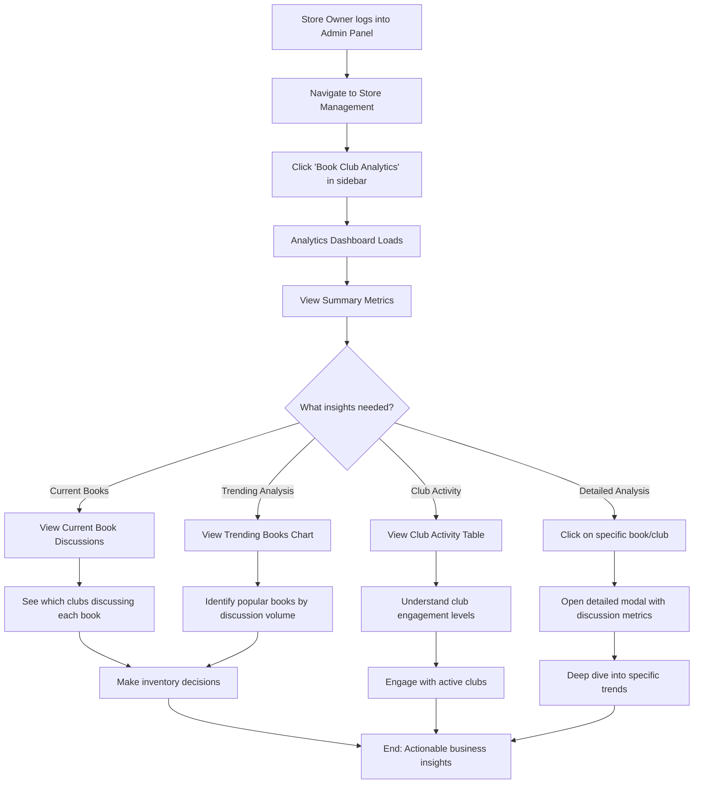
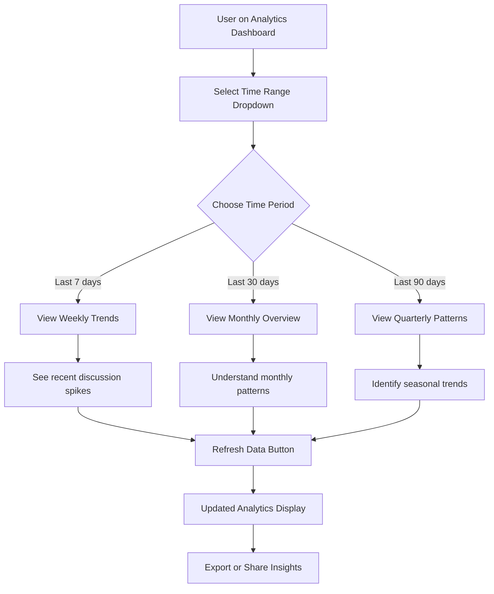
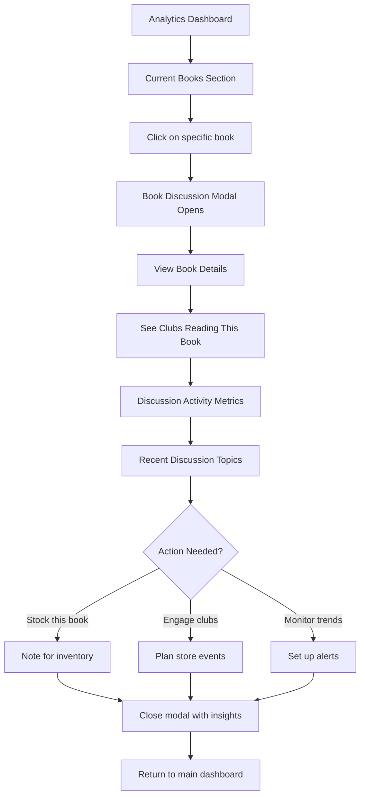
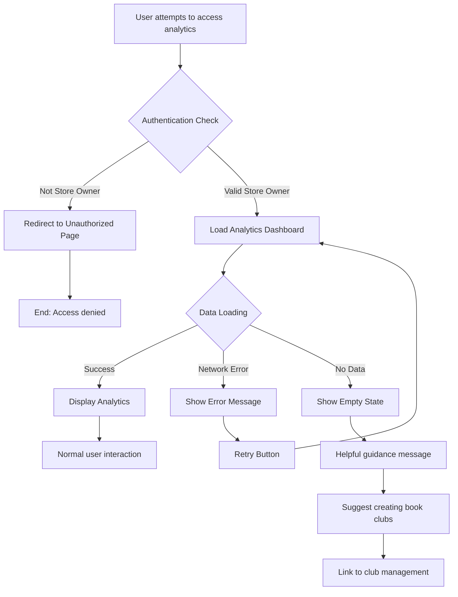
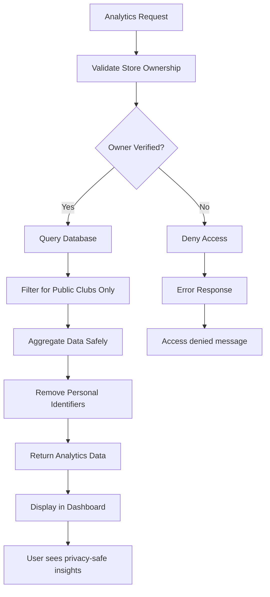
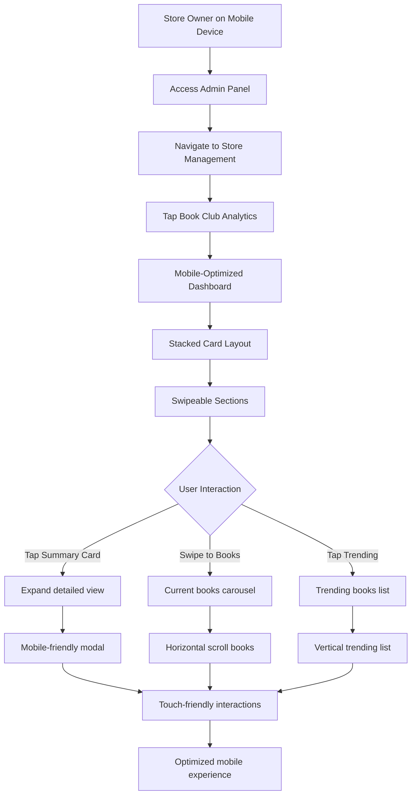
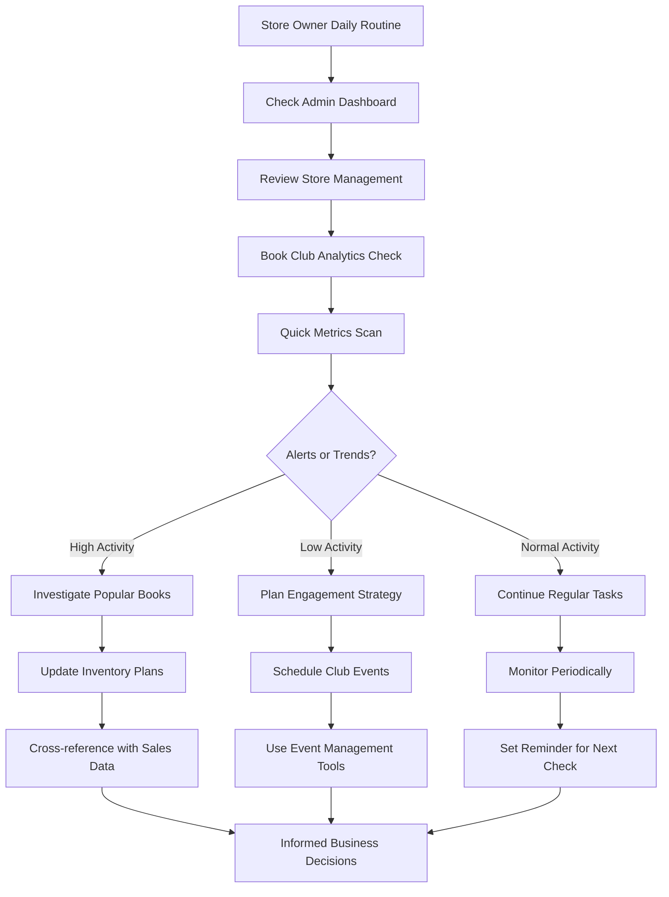
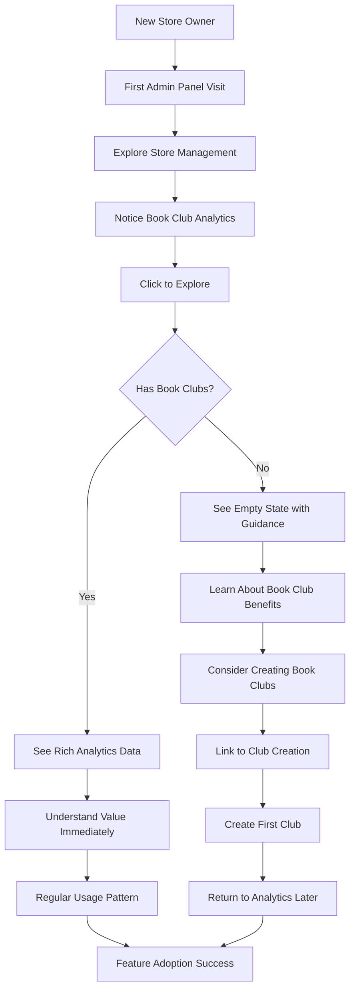
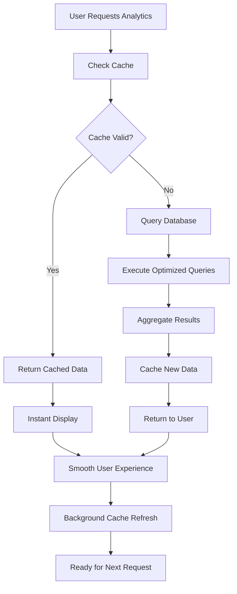

# Book Club Analytics - User Flows

## Overview

This document outlines the user flows for the Book Club Analytics feature, showing how store owners will interact with the analytics dashboard to gain insights about book club activities.

## Primary User Flow: Accessing Book Club Analytics

## Secondary User Flow: Time Range Analysis

## User Flow: Book Discussion Deep Dive

## Error Handling Flow

## Data Privacy Flow

## Mobile Responsive Flow

## Integration with Existing Workflows

## Feature Discovery Flow

## Performance Optimization Flow

## Key User Interactions

### Primary Actions
1. **Navigate to Analytics**: Store Management → Book Club Analytics
2. **View Summary**: Scan key metrics cards
3. **Explore Current Books**: See what's being discussed now
4. **Analyze Trends**: Identify popular books and patterns
5. **Deep Dive**: Click for detailed book/club information

### Secondary Actions
1. **Change Time Range**: Adjust analysis period
2. **Refresh Data**: Get latest information
3. **Export Insights**: Save or share analytics
4. **Navigate to Related Features**: Link to club management

### Error Recovery Actions
1. **Retry on Failure**: Reload data if network issues
2. **Report Issues**: Feedback mechanism for problems
3. **Fallback Navigation**: Return to main dashboard

## Accessibility Considerations

### Keyboard Navigation
- Tab through all interactive elements
- Enter/Space to activate buttons
- Arrow keys for chart navigation
- Escape to close modals

### Screen Reader Support
- Descriptive labels for all metrics
- Alt text for charts and visualizations
- Proper heading hierarchy
- Status announcements for data updates

### Visual Accessibility
- High contrast color schemes
- Scalable text and UI elements
- Clear visual hierarchy
- Color-blind friendly charts

## Success Metrics for User Flows

### Engagement Metrics
- Time spent on analytics dashboard
- Frequency of visits
- Feature usage distribution
- User retention rates

### Task Completion Metrics
- Successful navigation to analytics
- Completion of insight discovery tasks
- Error recovery success rates
- Mobile vs desktop usage patterns

### Business Impact Metrics
- Correlation with inventory decisions
- Club engagement improvements
- Store owner satisfaction scores
- Feature adoption rates
