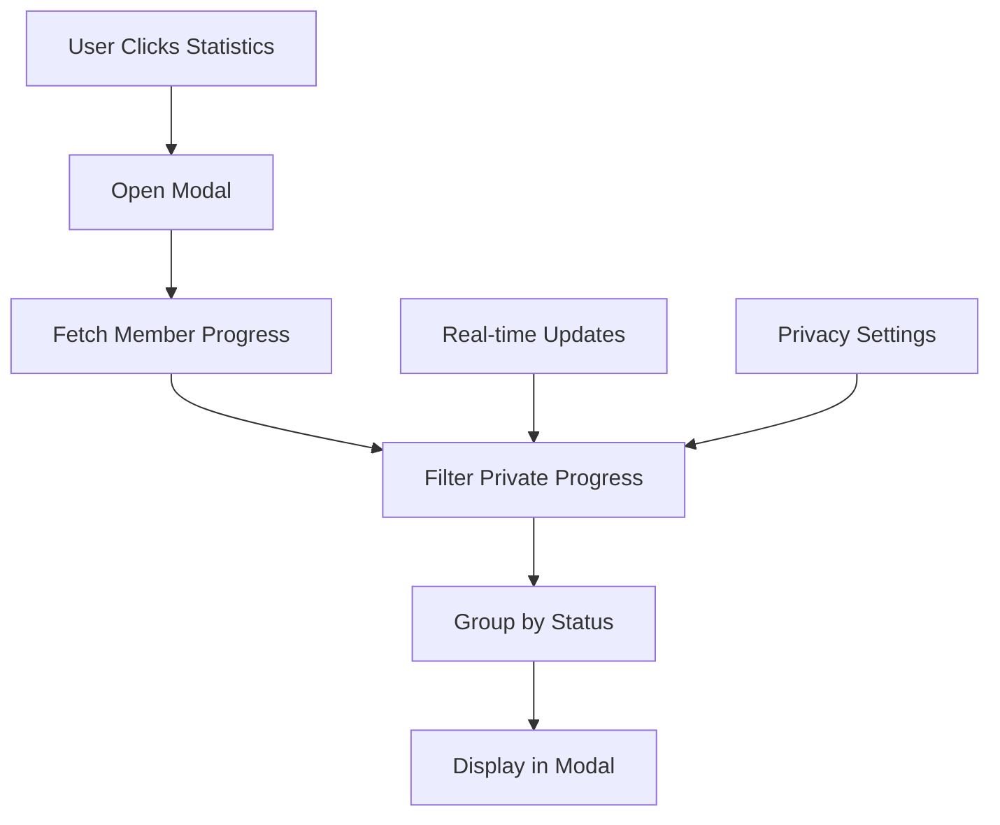

# Club Progress Details Modal Feature

## 📋 Overview

The Club Progress Details Modal is a comprehensive feature that provides detailed member progress information in an interactive modal dialog. This feature enhances the reading progress tracking system by allowing club members to view detailed progress information for all club members while respecting privacy settings.

## 🎯 Feature Requirements

### **Core Functionality**
- **Clickable Statistics**: Club progress statistics are clickable to open detailed view
- **Modal Dialog**: Popup dialog showing organized member progress information
- **Member Categories**: Members grouped by reading status (Not Started, Reading, Finished)
- **Privacy Compliance**: Only shows public progress, excludes private progress
- **Real-time Updates**: Live synchronization of progress changes

### **User Interface**
- **Responsive Design**: Works on mobile and desktop
- **Accessibility**: Keyboard navigation and screen reader support
- **Visual Indicators**: Clear categorization with icons and badges
- **Member Information**: Avatar, name, progress details, timestamps

## 🏗️ Technical Implementation

### **Component Architecture**

#### **ClubProgressDetailsModal Component**
**File**: `src/components/bookclubs/progress/ClubProgressDetailsModal.tsx`

**Props Interface**:
```typescript
interface ClubProgressDetailsModalProps {
  isOpen: boolean;
  onClose: () => void;
  clubId: string;
  bookId?: string;
  clubStats: ClubProgressStats | null;
  onMemberProgressUpdate?: (progress: MemberProgressSummary[]) => void;
  className?: string;
}
```

**Key Features**:
- Real-time progress updates via `useProgressRealtime` hook
- Privacy-compliant data filtering
- Responsive modal layout
- Member categorization by reading status
- Optimized data loading with fallback mechanisms

#### **CurrentBookSection Integration**
**File**: `src/components/bookclubs/sections/CurrentBookSection.tsx`

**Changes Made**:
- Added clickable statistics with hover effects
- Integrated modal trigger functionality
- Added keyboard accessibility
- Enhanced visual feedback for clickable elements

### **Data Flow**



### **Privacy Implementation**

#### **Privacy Filtering Logic**
```typescript
// Filter out private progress (only show public progress)
const publicProgress = progress.filter(p => !p.is_private);
```

#### **Privacy Rules**
- **Public Progress**: Visible to all club members
- **Private Progress**: Completely hidden from other members
- **Self-Access**: Users can always see their own progress (handled elsewhere)
- **Statistics Impact**: Private progress excluded from club-wide statistics

### **Real-time Integration**

#### **Real-time Hook Usage**
```typescript
const {
  memberProgress: realtimeMemberProgress,
  loading: realtimeLoading
} = useProgressRealtime({
  clubId,
  userId: user?.id || '',
  enabled: isOpen && !!user?.id,
  showToasts: false, // Don't show toasts in modal
  onMemberProgressUpdate: (progress) => {
    const publicProgress = progress.filter(p => !p.is_private);
    setMemberProgress(publicProgress);
    onMemberProgressUpdate?.(publicProgress);
  }
});
```

#### **Update Mechanisms**
- **Optimistic Updates**: Immediate UI updates for better UX
- **Real-time Sync**: Live updates when other members change progress
- **Fallback Loading**: Manual fetch if real-time data unavailable
- **Error Handling**: Graceful degradation with retry mechanisms

## 🎨 User Interface Design

### **Modal Layout**

#### **Header Section**
- Modal title with icon
- Summary statistics display
- Close button

#### **Content Sections**
1. **Finished Reading**
   - Green checkmark icon
   - Member count badge
   - List of completed members

2. **Currently Reading**
   - Blue clock icon
   - Member count badge
   - Progress details for active readers

3. **Not Started**
   - Gray circle icon
   - Member count badge
   - List of members who haven't started

#### **Member Cards**
Each member card displays:
- **Avatar**: User profile image
- **Name**: Display name with tier badge
- **Progress Indicator**: Visual status indicator
- **Progress Details**: Percentage, chapter, or page information
- **Last Updated**: Relative timestamp
- **Privacy Note**: Indication that notes are private

### **Responsive Design**

#### **Desktop Layout**
- **Modal Size**: `max-w-4xl` with centered positioning
- **Grid Layout**: Multi-column member cards
- **Hover Effects**: Enhanced interactivity

#### **Mobile Layout**
- **Modal Size**: `w-[95vw]` for optimal mobile viewing
- **Single Column**: Stacked member cards
- **Touch Targets**: Optimized for touch interaction

### **Accessibility Features**

#### **Keyboard Navigation**
- **Tab Navigation**: Full keyboard accessibility
- **Enter/Space**: Activate clickable elements
- **Escape**: Close modal

#### **Screen Reader Support**
- **ARIA Labels**: Descriptive labels for all interactive elements
- **Role Attributes**: Proper semantic markup
- **Focus Management**: Logical focus flow

## 🔧 Usage Instructions

### **For Club Members**

#### **Viewing Detailed Progress**
1. **Navigate** to your book club page
2. **Locate** the "Club Reading Progress" section
3. **Click** anywhere on the statistics box
4. **View** detailed member progress organized by status
5. **Close** modal when finished

#### **Understanding the Display**
- **Green Section**: Members who finished the book
- **Blue Section**: Members currently reading with progress
- **Gray Section**: Members who haven't started yet
- **Privacy**: Only public progress is shown

### **For Developers**

#### **Integration Steps**
1. **Import** the component:
```typescript
import { ClubProgressDetailsModal } from '@/components/bookclubs/progress';
```

2. **Add** state management:
```typescript
const [showProgressDetailsModal, setShowProgressDetailsModal] = useState(false);
```

3. **Create** click handler:
```typescript
const handleStatsClick = () => {
  setShowProgressDetailsModal(true);
};
```

4. **Render** the modal:
```typescript
<ClubProgressDetailsModal
  isOpen={showProgressDetailsModal}
  onClose={() => setShowProgressDetailsModal(false)}
  clubId={clubId}
  bookId={bookId}
  clubStats={clubStats}
/>
```

## 📊 Performance Considerations

### **Data Loading**
- **Lazy Loading**: Modal content loads only when opened
- **Real-time Optimization**: Efficient subscription management
- **Memory Management**: Proper cleanup on modal close

### **Rendering Optimization**
- **Virtual Scrolling**: For large member lists (future enhancement)
- **Memoization**: Optimized re-rendering
- **Efficient Filtering**: Client-side privacy filtering

## 🔒 Security & Privacy

### **Privacy Protection**
- **Client-side Filtering**: Private progress never sent to unauthorized users
- **Server-side Validation**: Database-level privacy enforcement
- **No Override**: No administrative access to private progress

### **Data Security**
- **Authentication Required**: Only authenticated club members can access
- **Club Membership Validation**: Server-side membership verification
- **Secure API Calls**: All requests properly authenticated

## 🚀 Future Enhancements

### **Potential Improvements**
1. **Search/Filter**: Search members by name or progress status
2. **Sorting Options**: Sort by progress, last updated, or name
3. **Export Functionality**: Export progress data for club leads
4. **Progress History**: View historical progress changes
5. **Bulk Actions**: Mass progress updates for club leads

### **Performance Optimizations**
1. **Virtual Scrolling**: For clubs with many members
2. **Pagination**: Server-side pagination for large datasets
3. **Caching**: Intelligent caching of member progress data
4. **Offline Support**: Cached data for offline viewing

## 📈 Analytics & Insights

### **Usage Metrics**
- **Modal Open Rate**: How often members view detailed progress
- **Engagement Time**: Time spent viewing member progress
- **Privacy Adoption**: Percentage of private vs public progress

### **Club Insights**
- **Reading Patterns**: Identify reading trends and engagement
- **Member Activity**: Track active vs inactive members
- **Progress Velocity**: Measure reading speed across the club

This feature significantly enhances the social aspect of BookTalks Buddy by providing transparency and engagement while maintaining strict privacy controls.
