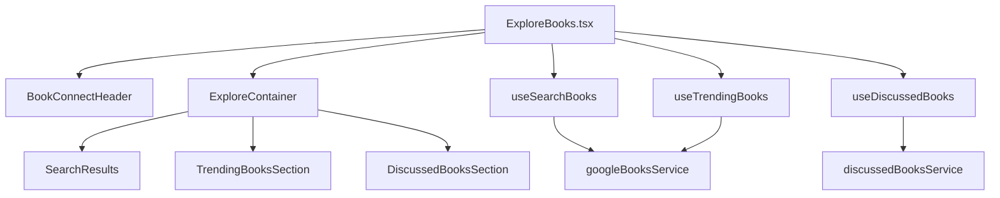

# Explore Page Refactor & Improvement Plan

---

## Overview

This document details the current architecture of the Explore page and provides a comprehensive plan to improve **code quality**, **maintainability**, **performance**, and **styling consistency**. The goal is to modularize data fetching, enforce strict typing, centralize API logic, optimize performance, and ensure a smooth migration.

---

## 1. Current Explore Page Architecture

### Main File
- `src/pages/ExploreBooks.tsx`

### Key Components
- `src/components/books/ExploreContainer.tsx`
- `src/components/books/SearchResults.tsx`
- `src/components/books/TrendingBooksSection.tsx`
- `src/components/books/DiscussedBooksSection.tsx`
- `src/components/books/ExploreHeader.tsx`

### Data Fetching Hook
- `src/hooks/useExploreBooks.ts`

### Services
- `src/services/googleBooksService.ts`
- `src/services/discussedBooksService.ts`

### Types
- `src/types/books.ts`

---

## 2. Identified Issues

- **Monolithic hook**: `useExploreBooks` handles all data fetching, making it large and harder to maintain.
- **Mixed concerns**: Components may handle both data fetching and presentation.
- **Duplicated error/loading UI**: No shared components for these states.
- **Inconsistent API handling**: Service calls are scattered without a unified pattern.
- **Type safety gaps**: Potential use of implicit or `any` types.
- **Limited test coverage**: Difficult to test large hooks and mixed-responsibility components.
- **No explicit migration plan**: Risk of regressions during refactor.
- **Unclear dependency management**: How to handle existing dependencies during migration.
- **Performance optimization opportunities**: Caching, batching, pagination.
- **Styling consistency**: No guidance on design tokens or Tailwind theming.

---

## 3. Refactoring Plan

### 3.1 Modularize Data Fetching Hooks

Split `useExploreBooks` into smaller, focused hooks:

- `useSearchBooks(searchQuery: string)`
- `useTrendingBooks(genre: string)`
- `useDiscussedBooks()`

**Benefits:**
- Single responsibility
- Easier testing
- Reusable in other parts of the app

---

### 3.2 Component Responsibility

- Components should be **presentational only**.
- Receive data and callbacks as props.
- Avoid prop drilling by returning structured data from hooks.

**Example:**

```tsx
<SearchResults 
  books={searchResults} 
  isLoading={isSearching} 
  onSearch={handleSearch} 
/>
```

---

### 3.3 Centralize API Logic

- Create a **common API utility** for fetch, error handling, and response parsing.
- Services (`googleBooksService.ts`, `discussedBooksService.ts`) should use this utility.
- Standardize error formats and response types.

---

### 3.4 Reusable UI Components

- **Loading Skeletons:** Placeholder components during data fetch.
- **Error Boundaries:** Consistent error display with retry options.

---

### 3.5 Enforce Strict Typing

- Enable `"strict": true` in `tsconfig.json`.
- Define clear interfaces/types for:
  - Book data
  - API responses
  - Component props
  - Hook return values

- Store shared types in `src/types/books.ts`.

---

### 3.6 Code Organization

- Group related files:

```
src/
├── hooks/
│   └── explore/
│       ├── useSearchBooks.ts
│       ├── useTrendingBooks.ts
│       └── useDiscussedBooks.ts
├── components/
│   └── explore/
│       ├── SearchResults.tsx
│       ├── TrendingBooksSection.tsx
│       ├── DiscussedBooksSection.tsx
│       └── ExploreContainer.tsx
```

- Improves discoverability and modularity.

---

### 3.7 Testing Strategy

- Use **React Testing Library** and **Jest**.
- **Unit tests** for:
  - Custom hooks (mock API calls)
  - Presentational components (snapshot, interaction)
- **Integration tests** for Explore page composition.

---

### 3.8 Documentation

- Add **JSDoc comments** for all hooks and components.
- Maintain this plan and architecture notes in the `docs/` folder.
- Update as the implementation evolves.

---

## 4. Migration Strategy

- **Incremental refactor**: Extract and replace one hook/component at a time.
- **Order of migration:**
  1. Create shared types and API utility.
  2. Extract `useSearchBooks` and update `SearchResults`.
  3. Extract `useTrendingBooks` and update `TrendingBooksSection`.
  4. Extract `useDiscussedBooks` and update `DiscussedBooksSection`.
  5. Refactor `ExploreContainer` and `ExploreBooks.tsx` to use new hooks/components.
  6. Integrate reusable loading/error components.
  7. Add tests after each step.
- **Parallel implementation:** Keep old and new components/hooks side-by-side during transition if needed.
- **Feature toggles:** Use flags or environment variables to switch between old and new implementations safely.
- **Testing checkpoints:** After each phase, run tests and verify UI.

---

## 5. Dependency Handling

- **Service calls:** Abstracted via API utility, so changes are isolated.
- **Component props:** Define clear interfaces to reduce coupling.
- **Context/state:** If shared state/context is used, refactor gradually to avoid breaking dependencies.
- **Imports:** Update imports incrementally as components/hooks are migrated.
- **Styling:** Maintain existing Tailwind classes initially, then refactor to use design tokens.

---

## 6. Performance Optimization

- **React Query tuning:**
  - Adjust `staleTime` and `cacheTime` for optimal caching.
  - Use **prefetching** for trending and discussed books.
  - Consider **pagination** or **infinite queries** for large datasets.
- **Batch API calls** where possible to reduce network overhead.
- **Lazy load** non-critical sections (e.g., trending, discussed).
- **Debounce** search input to minimize API calls.
- **Memoize** components and hook outputs to avoid unnecessary renders.

---

## 7. Design Tokens & Styling Consistency

- **Tailwind CSS customization:**
  - Define a **custom theme** in `tailwind.config.ts` for colors, spacing, typography.
  - Use **Tailwind CSS variables** for runtime theming if needed.
- **Design tokens:**
  - Document primary colors, font sizes, spacing units.
  - Use consistent tokens across all Explore components.
- **Component extraction:**
  - Maintain existing styling initially.
  - Gradually refactor to use design tokens for consistency.
- **Accessibility:**
  - Ensure color contrast and font sizes meet accessibility standards.

---

## 8. Future Considerations

- **Pagination or infinite scroll** for large datasets.
- **Lazy loading** of sections for faster initial render.
- **Genre filters** or personalized recommendations.
- **Server-side rendering (SSR)** or static generation for faster load (if framework supports).

---

## 9. Summary Table

| Area                     | Current State                          | Improvement Plan                                         |
|--------------------------|----------------------------------------|----------------------------------------------------------|
| Data Fetching            | Centralized but monolithic hook        | Split into focused hooks                                 |
| Component Design         | Mixed concerns                         | Presentational only, props-driven                        |
| API Handling             | Scattered, inconsistent                | Centralized utility, standardized                        |
| Error/Loading UI         | Duplicated                             | Reusable components                                     |
| Typing                   | Partial                                | Strict, explicit, shared interfaces                      |
| Code Organization        | Flat                                   | Grouped by feature                                       |
| Testing                  | Limited                                | Unit + integration tests                                 |
| Documentation            | Minimal                                | Comprehensive, up-to-date                                |
| Migration                | None                                   | Incremental, safe, with checkpoints                      |
| Dependencies             | Implicit, scattered                    | Explicit, modular, well-documented                       |
| Performance              | Basic caching                          | Tuned caching, batching, lazy loading                    |
| Styling                  | Tailwind utility classes               | Design tokens, Tailwind theme, consistent styling        |

---

## 10. Target Explore Page Architecture



---

## 11. Conclusion

This plan aims to create a **modular, maintainable, performant, and well-documented** Explore page architecture. It facilitates easier feature additions, improves developer experience, and ensures long-term code quality with minimal migration risk.

---

*Prepared on 2025-04-08, updated with migration, dependencies, performance, and styling considerations.*