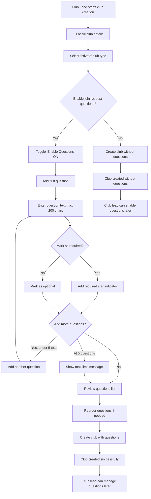
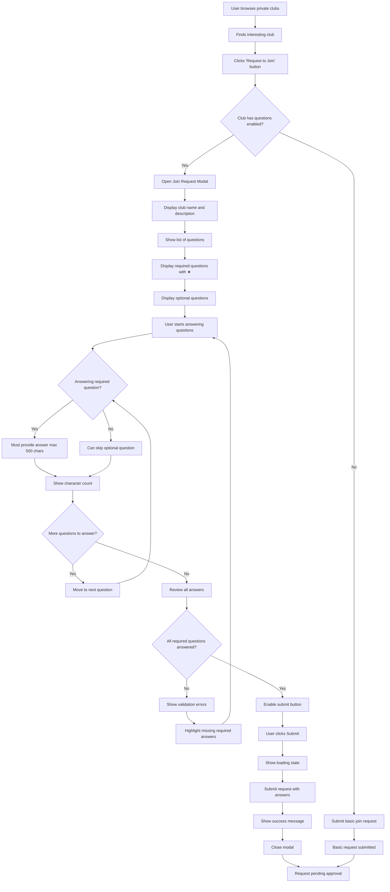
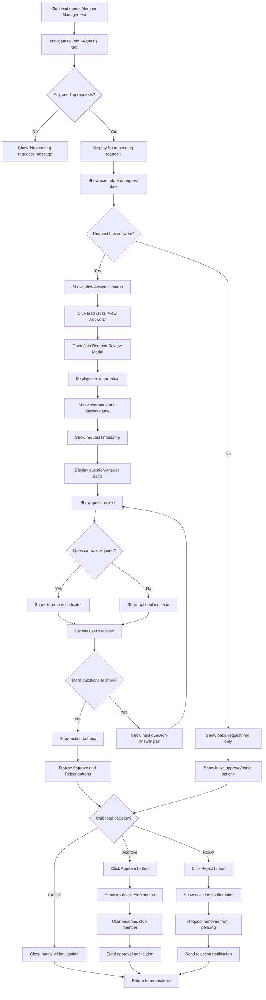
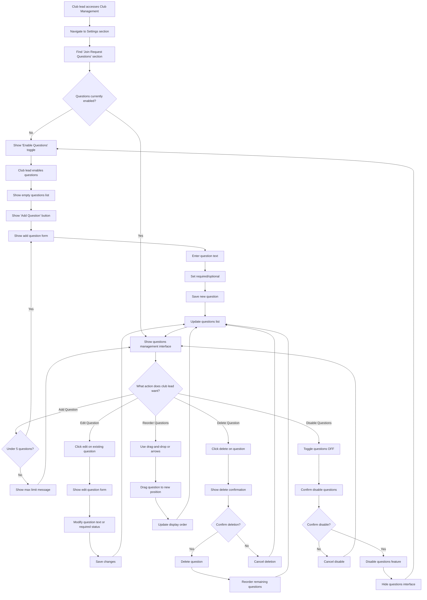
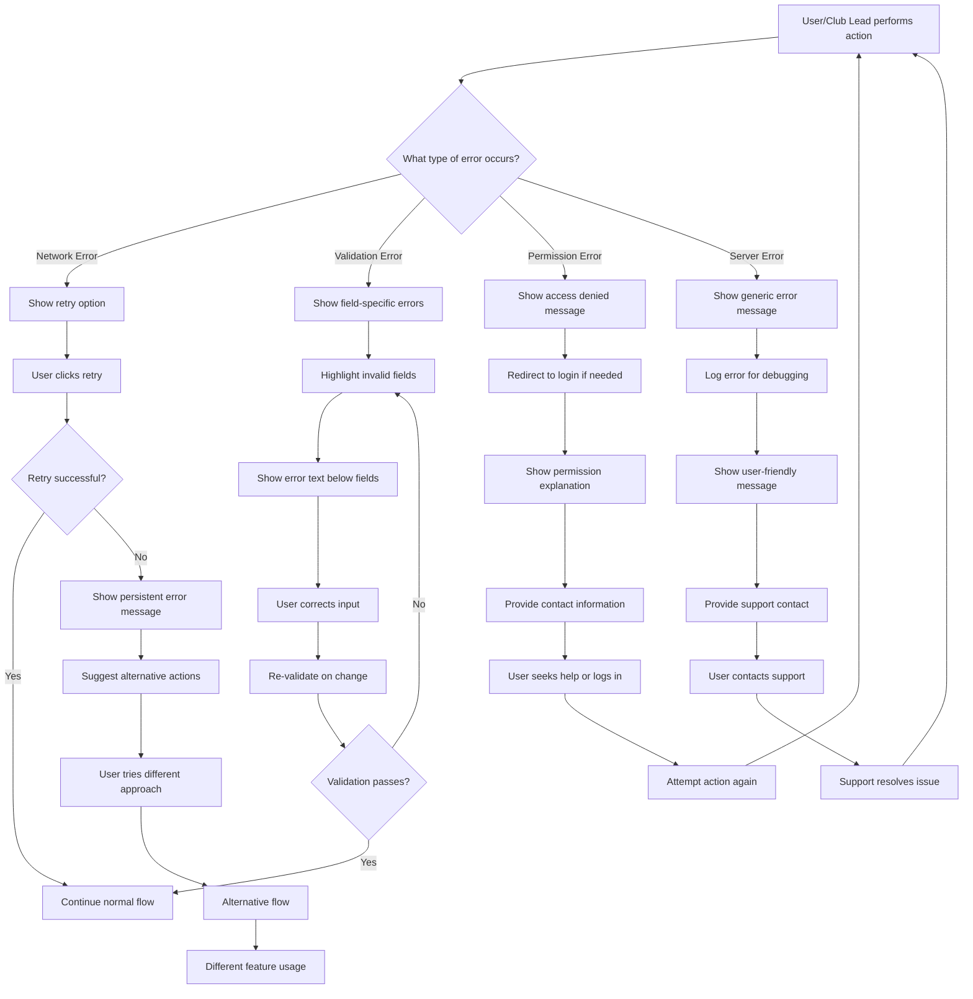
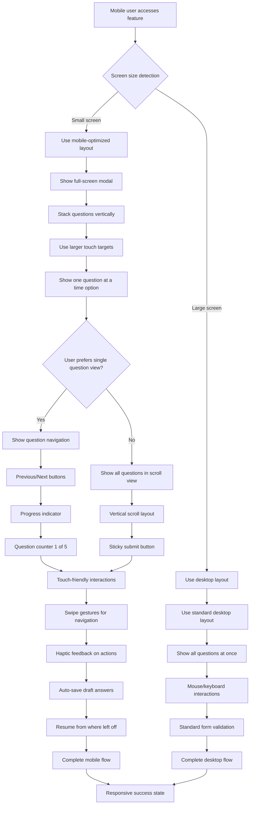

# Join Request Form Questions - User Flows

## Overview

This document contains detailed user journey diagrams showing the complete flow for the Join Request Form Questions feature. The flows are designed using Mermaid diagrams to visualize the user experience from different perspectives.

---

## **Flow 1: Club Creation with Questions**

---

## **Flow 2: User Join Request with Questions**

---

## **Flow 3: Club Lead Answer Review Process**

---

## **Flow 4: Post-Creation Question Management**

---

## **Flow 5: Error Handling and Edge Cases**

---

## **Flow 6: Mobile-Specific Interactions**

---

## **Integration Points**

### Existing System Touchpoints
1. **Club Creation Flow**: Integrates with `CreateBookClubForm` component
2. **Join Request System**: Extends existing `joinOrRequestClub` API
3. **Member Management**: Enhances `MemberManagementPanel` component
4. **Permission System**: Uses existing club lead permission checks
5. **Notification System**: Leverages existing approval/rejection notifications

### Data Flow Integration
1. **Questions Storage**: New `club_join_questions` table
2. **Answers Storage**: JSONB column in existing `club_members` table
3. **Club Settings**: New column in existing `book_clubs` table
4. **User Sessions**: Maintains existing authentication flow
5. **Real-time Updates**: Uses existing Supabase real-time subscriptions

---

## **Accessibility Considerations**

### Screen Reader Support
- All modals have proper ARIA labels and descriptions
- Question requirements clearly announced
- Form validation errors read aloud
- Progress indicators accessible

### Keyboard Navigation
- Tab order follows logical flow
- All interactive elements keyboard accessible
- Modal focus management
- Escape key closes modals

### Visual Accessibility
- High contrast for required question indicators
- Clear visual hierarchy
- Sufficient color contrast ratios
- Scalable text and UI elements

---

**Last Updated**: January 15, 2025  
**Diagram Format**: Mermaid  
**Maintained By**: Development Team
